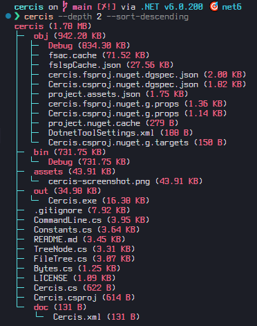
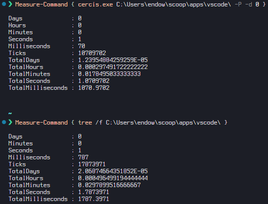

# Cercis

This is a lame .NET 6.0 ripoff of [solidiquis/erdtree](https://github.com/solidiquis/erdtree).

A bLazInGlY sLoW, skinnier version of the ancient [tree](https://en.wikipedia.org/wiki/Tree_(command)) command which displays a colorful depth indented listing of files
with their memory sizes adjacent.



## Usage

```text
Usage:
    cercis [directory] [options]

Directory:
    Directory to traverse. Defaults to current working directory.

Options:
    -d, --depth            Unsigned integer indicating how any nested directory levels to display. Defaults to all.
    -p, --ignore-patterns  Comma-separated list of prefixes. Directories containing any of
                           these prefixes will not be traversed. Their memory size will be ignored.
    -P, --no-ignore        Do not ignore any directories.
    -s, --sort             Sort tree by memory-size ascending.
    -S, --sort-descending  Sort tree by memory-size descending.
    -h, --help             Displays help prompt.

```

## Installation

There is none yet.
This is lame, remember?

## Build

Snag a dotnet SDK, version 6.0.23 or higher.
Clone this repo and run `dotnet build`.
It has no dependencies, so, it should be quick.

You can then run `dotnet run`.

### Windows Toolless Build

If you are running a Windows 10 machine and don't want to use `dotnet`, then `git clone https://github.com/endowdly/cercis/tree/oldschool` and run the `build.cmd` file.
An executable binary will compile to `out`, which you can then manually add to your path.

Every Windows 10 build comes with its own csharp compiler. 
The `old-school` branch packages an old script w/response file setup I used to build medium-complexity projects on an organizationally limited system with no development tools. 

It may not be as performant as this branch due to sketchy native kernel calls and lack of optimization.

## Disambiguation about units for memory

As recommended in [IEC 80000-13](https://en.wikipedia.org/wiki/ISO/IEC_80000#cite_note-80000-13:2008-14), this utility will report memory sizes
using SI units rather than binary units. As such you can expect `1KB = 1000B` and not `1KiB = 1024B`.

(Good call solidiquis).

## Questions you might have

_Q: You ripped off erdtree!_

It's not a question.
But, yes I did.
As such, I included the original MIT license instead of my usual preference Unlicense.
If you fork this repo, be sure to do the same and credit the original coder.
This is not enough of a derivative, in my opinion.

Although, as I work on bugs and make improvements, the code is drifiting from the original implementation. 
It could be a fork soon.

_Q: What the hell is a Cercis anyway?_

Erdtree is an homage to Elden Ring.
[_Cercis_](https://en.wikipedia.org/wiki/Cercis) is a genus of trees (in real life) whose flowers erupt all over.
To me, their appearance is similar to the Erdtree, albeit tiny, non-luminous versions.

_Q: Cercis hangs when I call it on some folders?_

A: I fixed this. It was a reparse point traversal issue.

_Q: Why did you make this? It's totally, TOTALLY unnecessary._

Mostly because I couldn't build erdtree with cargo or rustup in two attempts.
Instead of trying to track down the issue with my tooling (or with erdtree's implementation), I decided to just bang it out in C#.
Also, I was bored.

_Q: Is it any good?_

Haha, no.
But, it does work!
And you don't need Rust.
Though you might want to get Rust.
Or I may want to rewrite this in C.

_Q: How do you know that this is blazingly slow?_

It's not written in Rust.

Seriously though, _cercis is kind of fast_. 
It's a least comparable to `tree.com`, which doesn't even get size information.


